# <center>内存与数据排列</center>

## 1. 数据表示方法

### 1.1 Tensor的 shape 与 stride
Tensor 是一个4维数组，使用4元组(N,C,H,W)来描述一个Tensor的几何尺寸（ Shape ）。 Tensor(n, c, h, w)表示在（n,c,h,w）索引下的数据元素。
Stride 用于描述Tensor在实际内存当中是如何摆放，同样使用4元组（N_stride，C_stride，H_stride，W_stride）来描述， 表示 Tensor 在内存当中存放时，元素间间隔了多少元素，具体而言：
- W_stride 描述的是从Tensor（n,c,h,w）到Tensor（n,c,h,w+1）两个元素之间，在内存存储时，间隔了多少个元素。
- H_stride 描述的是从Tensor（n,c,h,w）到Tensor（n,c,h+1,w）两个元素之间，在内存存储时，间隔了多少个元素。
- C_stride 描述的是从Tensor（n,c,h,w）到Tensor（n,c+X,h,w）两个元素之间，在内存存储时，间隔了多少个元素，X表示NPU的数量。
- N_stride 描述的是从Tensor（n,c,h,w）到Tensor（n+1,c,h,w）两个元素之间，在内存存储时，间隔了多少个元素。

> **什么是Tensor(n, c, h, w)？**
Tensor：是一个 4 维数组，用 4 元组 (N, C, H, W) 表示：
N：Batch 大小（样本数）
C：通道数（比如图像的RGB就有3个通道）
H：高度（图像行数）
W：宽度（图像列数）
Stride（步长）：描述 内存中相邻元素之间的距离（偏移量），以元素个数为单位（而不是字节）。

>**什么是 Batch 样本 (N)？**
Batch 是深度学习中用于 一次性并行处理多个样本 的一种技术。
例如，如果你要让模型一次处理 32 张图片，那么 N=32，即 batch size=32。
这样可以充分利用硬件资源（比如 TPU/GPU），提高计算效率和吞吐量。
💡 在张量 Tensor(N,C,H,W) 中：
N 表示批大小 (batch size)，也就是有多少个样本（图片/音频/文本片段）一起处理。
比如：(32,3,224,224) 表示一次处理 32 张 RGB（3通道）224x224 像素的图片。

>**什么是 通道 (C)？**
C 是 Channel（通道），指每个样本的数据维度。
对于图像：
彩色图（RGB）有 3 个通道（R,G,B），所以 C=3。
黑白图（灰度图）只有 1 个通道（C=1）。
对于其他数据（比如语音、文本），C 表示特征维度，比如每帧音频的频谱维度、每个时间步的 embedding 维度。

假设现在有一个Tensor，它的每一个元素都占1个byte，它的Shape是（4，3，2，2）， 如果它的存储方式Stride是（12，4，2，1），在内存当中，它的排列方式就会如下图所示，
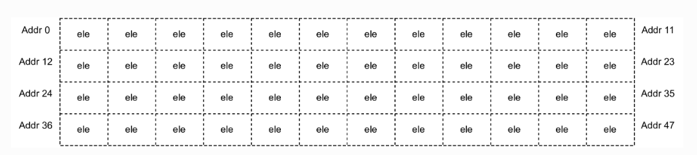
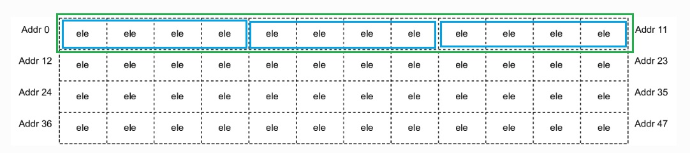

如果Tensor的存储方式Stride是（24，8，4，2），在内存当中，Tensor的排列方式就会如下所示，
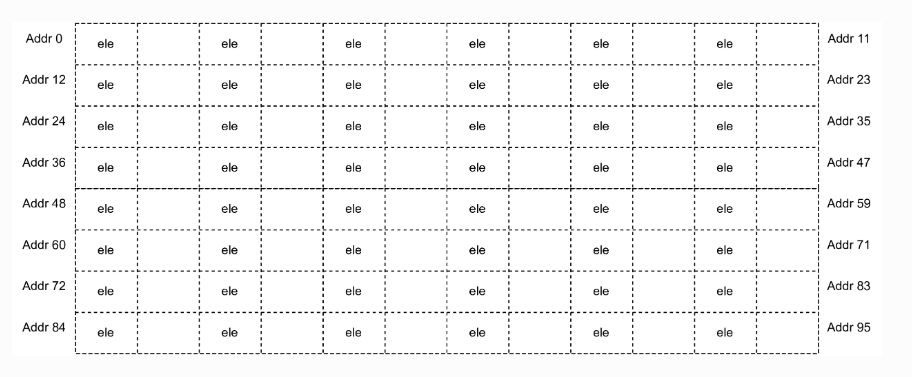
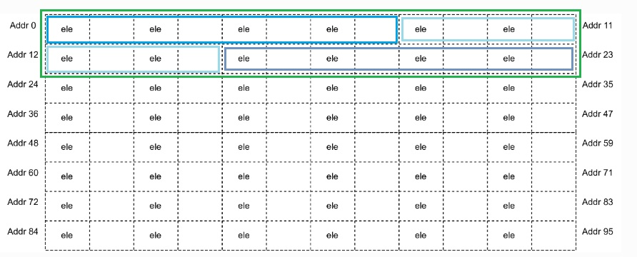

### 1.2 数据元素类型
Stride 以元素个数作为计量单位。不同类型的数据元素占据不同的字节数， 在BM1684x芯片上支持如下格式的数据类型:
| 数据类型 | 字节数 |
| -------- | ------ |
| INT8     | 1Bytes |
| INT16    | 2Bytes |
| INT32    | 4Bytes |
| FP16     | 2Bytes |
| BFP16    | 2Bytes |
| FP32     | 4Bytes |

## 2. Tensor在gloabl memory的排列方式
global memory 由一块 **DDR 内存**组成。
一个Shape为（N，C，H，W）的Tensor，在 global memory 排列，对应的Stride为:
- W_Stride = 1,
- H_Stride = W,
- C_Stride = H * W,
- N_Stride = C * H * W。

这种排列方式被称为 连续存储方式 。

*举例： 一个Shape（N=2，C=2，H=3，W=2）的Tensor在global memory排列方式*

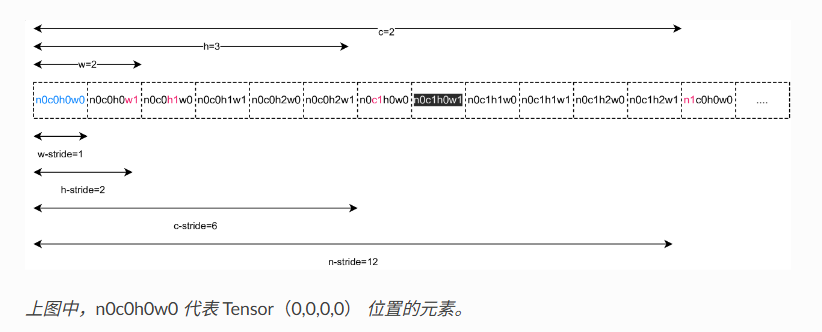

## 3. Tensor在local memory的排列方式

### 3.1 local memory的物理组成和地址分配
Local Memory共由多片SRAM（静态随机存取存储器）构成，每一片SRAM都被称为一个 Bank。
bm1684x芯片一共由16个Bank构成。16个Bank组成整个 local memory。
整个Local Memory同时被划分为了64个 lane (对应64个NPU，以下用NPU指代lane)，地址分配如下图所示：


>BM1684x 的 Local Memory 由16个独立的1MB SRAM（Bank）组成，总容量16MB。逻辑上，Local Memory 被划分为64段，每段256KB，分别分配给64个 NPU，每个 NPU 的地址空间是连续的256KB。硬件通过地址映射，将每个 NPU 的逻辑地址空间分散存储在16个物理 Bank 中，从而实现高效的并行访问与带宽利用。

>**为什么不按「4个NPU一个Bank」划分？**
提高 内存访问带宽 和 并行访问效率
TPU 的每个 NPU（lane）需要同时访问自己的局部数据（local memory）。
如果 4 个 NPU 共用一个 Bank，那么它们访问内存时就会「抢同一个柜子」，会产生 访问冲突（Bank Conflict），降低访问带宽。
把数据地址按 NPU 分区，打散到多个 Bank，让每个 NPU 能独立访问不同的物理 Bank，这样可以 并行处理更多任务，大大提高整体性能。
💡 类比：如果大家都去同一个柜子（Bank）取东西，会排队；但如果大家有独立的柜子（或系统自动帮你分散存取），就可以同时进行。

### 3.2 Tensor在Local memory上排列的基本规则
Tensor在Local Memory上的排布方式与global Memory的排布方式不同，主要区别在于 C维度的数据排布方式。 一个Shape为（N，C，H，W）的Tensor，Tensor（N,c,H,W）代表：当C = c时，Tensor的数据切片。 对于不同的c， Tensor（N，c，H，W）分配在不同的NPU上。

*举例，Tensor的Shape（N=2,C=3,H=2,W=3）,Stride（N_stride = 9，C_stride = 9, H_stride = 3, W_stride = 1） 那么Tensor在Local Memory上的数据排列方式如下所示。*

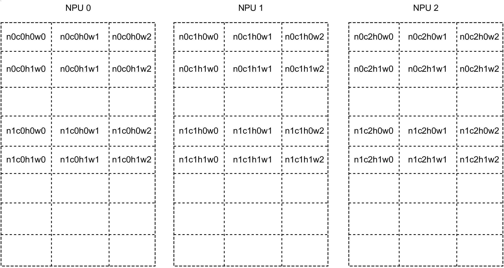

### 3.3 Local Memory上几种常用数据排布方式
#### 3.3.1 64-Bytes对齐存储方式
64-Bytes对齐存储方式”是最常用的Tensor存储方式，它是指Tensor排放存储要满足以下几个约束：
Tensor的起始地址是64的整数倍
- W_stride = 1
- H_stride = W
- C_stride = ceil(H * W, 16) * 16, 若数据元素是32-bits
  C_stride = ceil(H * W, 32) * 32, 若数据元素是16-bits
  C_stride = ceil(H * W, 64) * 64, 若数据元素是 8-bits
- N_stride = C_stride * (单个NPU上channel的个数)

其中 ceil 是向上取整的意思。可通过 ```tpu_aligned_stride()``` 计算 stride。

**假设NPU个数=4**
*举例1: Tensor的Shape(.N=2,.C=3,.H=4,.W=5),数据类型为float16， NPU0开始存储*

> 分析过程：
> - float16 即 16-bits数据，2B数据
> - 64B对齐代表 (64B / 2B) 即 32 个元素对齐，故
> - W_stride = 1
> - H_stride = W = 5
> - C_stride = ceil(20,32)*32 = 32元素
> - N_stride = C_stride * 1 = 32 * 1 = 32


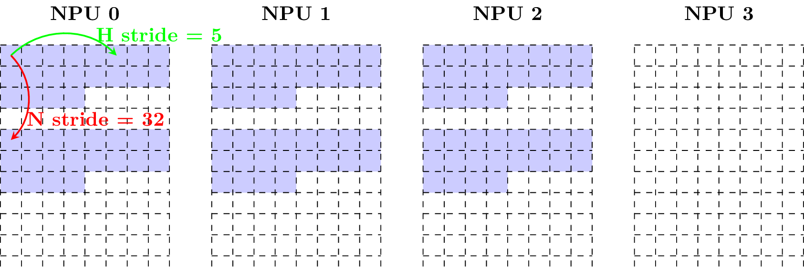

*举例2: Tensor的Shape(.N=2,.C=3,.H=4,.W=5),数据类型为float16，NPU2开始存储*

> - 分析过程：
>   由于从 NPU2 开始存储，因对齐所以需要每个NPU处理两个channel

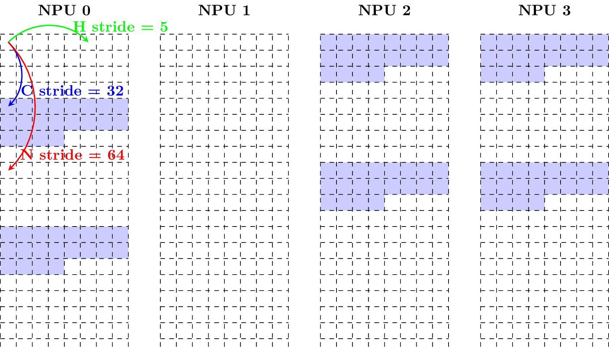

#### 3.3.2 紧凑存储方式
“紧凑存储方式”也是较为常用的Tensor存储方式。
假设Tensor的Shape为(N，C，H，W)，按照“紧凑存储方式存储”要满足以下约束：
- Tensor的起始地址是4的整数倍。
- W_stride = 1
- H_stride = W
- C_stride = H * W
- N_stride = C_stride * (单个NPU上channel的个数)

可通过``` tpu_compact_stride() ``` 计算 stride。

*举例1: Tensor的Shape(.N=2,.C=3,.H=4,.W=5),数据类型为float16， NPU0开始存储*

>- 分析过程：
>  W_stride = 1
>  H_stride = W = 5
>  C_stride = W * H = 20
>  N_stride = C_stride * Channel = 20 * 1 = 20

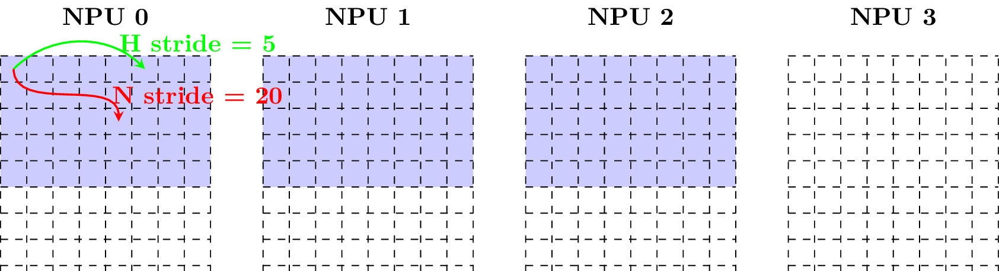

*举例2: Tensor的Shape(.N=2,.C=3,.H=4,.W=5),数据类型为float16，NPU2开始存储*

>- 分析过程：
>  N_stride = 20 * 2 = 40

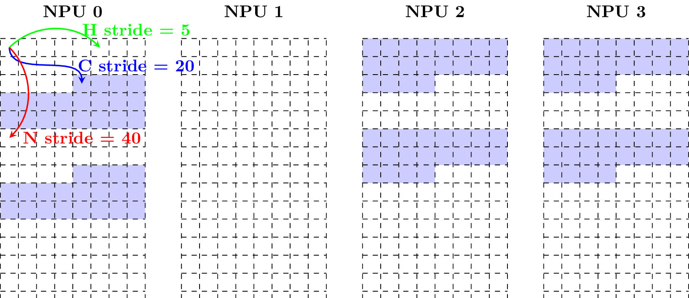

#### 3.3.3 矩阵存储方式
“矩阵存储方式”是 矩阵运算指令 用的数据存储方式。

对于一个n x m的矩阵，可以用Tensor的4维数组的形式来进行表示， 这个Tensor的Shape为(N=n,C=ceil(m/w),H=1,W=w),其中w可以为(1，m)之间的任意值。

>**如何用Tensor表示一个矩阵呢？**
>对于一个 n×m 的矩阵（n行、m列），可以用 Tensor（4维数组）的形式表示，其中：
>- Shape = (N=n, C=ceil(m/w), H=1, W=w)
>- 这里 w 是一个取值在[1, m]的参数。
>
>对应关系：
>- N=n：对应矩阵的行数（每行看作一个batch样本）。
>- W=w：对应每行分块的列宽（即把每行按w列分成若干块）。
>- C=ceil(m/w)：因为每行一共有m列，分成每块w列，总共有 ceil(m/w)块，所以C=ceil(m/w)。
>- H=1：每块的高度始终为1（因为原始矩阵只有1行）。

*举例1：矩阵的形状为(2x40)，数据类型为float16， w = 40*

>- 分析过程：
>n = 2, m = 40, 每块取40列，w = 40
>N = n = 2 （对应2行）
>C = ceil(40/40) = 1（每行需要1块，也就是分给1个NPU，每块40列）
>H = 1（每块高度固定为1）
>W = 40（每块宽度4列）
>- 故最后的Tensor表达为：``` Tensor Shape = (2, 1, 1, 40) ```
>采用64-Bytes对齐存储方式，C_stride = ceil(W,32) * 2 = ceil(40,32) * 32 = 2 * 32 = 64

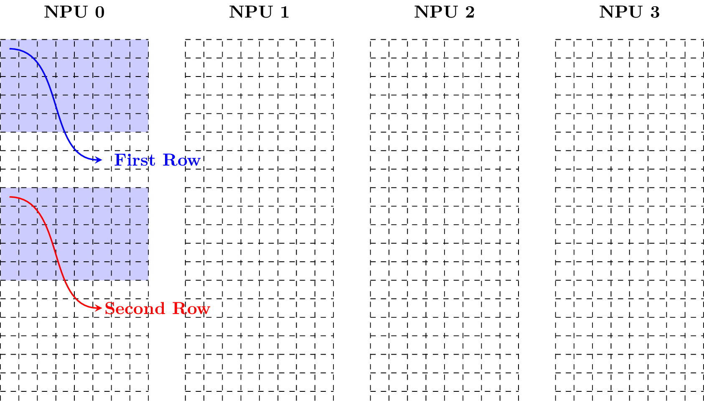

*举例2：矩阵的形状为(2x40)，数据类型为float16， w = 20*

>- 最后的Tensor表达为：``` Tensor Shape = (2, 2, 1, 20) ```
>采用64-Bytes对齐存储方式，C_stride = ceil(W,32) * 2 = ceil(20,32) * 32 = 1 * 32 = 32

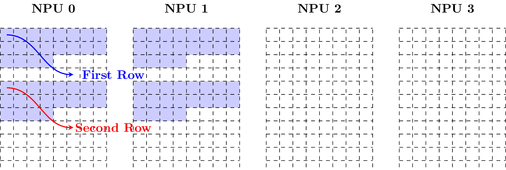

#### 3.3.4 向量存储方式

（相当于一个行为1的矩阵）
对于一个1 x m的向量，可以用Tensor的4维数组的形式来进行表示， 这个Tensor的Shape为(N=1,C=ceil(m/w),H=1,W=w),其中w可以为(1，m)之间的任意值。

#### 3.3.5 行64字节对齐存储方式
一种 4D 张量在 local memory 中的存储格式。张量的 shape 是 (N, C, H, W)，满足
- 地址被 64 整除
- W-stride 是 1
- H-stride 是 ceil(W / 16) * 16，如果元素的数据类型的位宽是 32-bit， ceil(W / 32) * 32，如果是 16-bit，ceil(W / 64) * 64，如果是 8-bit
- C-stride 是 H * H-stride
- N-stride 是 C-stride 乘以每个 NPU 的 channel 数

可通过``` tpu_line_aligned_stride() ```计算 stride。

#### 3.3.6 64IC/32IC 存储方式

64IC/32IC 存储是卷积核在 local memory 中的特殊存储方式，仅用于卷积计算过程。其中 INT8 kernel 以 64IC 格式存放， FP16/BFP16 kernel 以 32IC 格式存放。

假设卷积核的 shape 是 (ic, oc, kh, kw)，分别表示 input channel、 output channel、 卷积核的高度以及卷积核的宽度。

64IC 存储满足：
- W_stride = 64
- H_stride = 64 * kw
- C_stride = 64 * kw * kh * ceil(ic/64)
- N_stride = 64 * kw * kh * ceil(ic/64)

其中，每 64 个 input channel 作为一组进行存储，每组之间的 stride 为 64 * kw * kh。

32IC 存储满足：
- W_stride = 32
- H_stride = 32 * kw
- C_stride = 32 * kw * kh * ceil(ic/32)
- N_stride = 32 * kw * kh * ceil(ic/32)

其中，每 32 个 input channel 作为一组进行存储，每组之间的 stride 为 32 * kw * kh。


