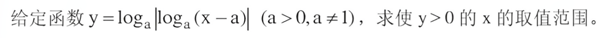
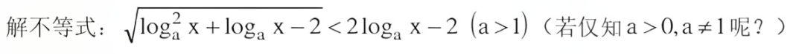
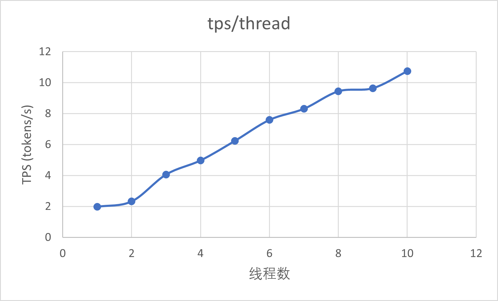

# 基于 Llama.cpp 的模型测试

## 1. 图像识别正确率测试

### 1.1 gemma-3-12B 模型

#### 1.1.1 高中数学题错误1：
**gemma-3 题目复述：**
已知 \(a\) 为实数，对区间 \([2, 8]\) 上任何实数 \(x\)，不等式 \(\log_{2a^{2-1}} x > -1\) 恒成立。求 \(a\) 的取值范围。

原题：


#### 1.1.2 高中数学题错误2：
**gemma-3 题目复述：**
题目要求：给定常数 $y = \log_a |x-a|$，其中 $a > 0, a \neq 1$，求 $y > 0$ 的 $x$ 的取值范围。

原题：


#### 1.1.3 高中数学题错误3：
**gemma-3 题目复述：**
已知不等式 \(\sqrt{\log^2 x + \log_a x - 2} < 2\log_a x - 2\) (a > 0, a ≠ 1)。求 x 的取值范围。

原题：


#### 1.2 Qwen2.5-vl 模型

读题均正确，猜测是由于Qwen2.5模型的mmproj权重文件远大于gemma-3的，可能是gemma-3的多模态能力较差

## 2. 内存占用与性能测试 (gemma-3-12B)

以下测试均在 llama.cpp + 纯CPU推理 + 8线程 + mtmd多模态命令行工具条件下进行

### 2.1 量化测试

测试参数：
- 8线程
- 上下文 2048 tokens
- 最多输出 2048 tokens
- temp=1.0 
- top-k=40 
- top-p=0.95 
- presence-penalty=1.2

测试结果：

| 量化格式     | 性能（tokens/s） | 内存占用（GB） | 模型大小（GB） |
| :------:     | :--------------: | :------------: | :------------: |
|  Q4_K_M      |       5.14       |     14.26      |      6.8       |
|  **IQ4_XS**  |       4.20       |      8.77      |      6.2       |
|  IQ4_NL      |       3.82       |      9.08      |      6.5       |
|  **Q3_K_L**  |       4.72       |      8.70      |      6.1       |
|  Q3_K_S      |       4.53       |      7.75      |      5.1       |
|  IQ3_M       |       2.69       |      8.70      |      5.3       |

### 2.2 命令行参数内存调优

经测试后发现仅有：```--cache-type-k q4_0``` 效果最佳，其余参数对内存调优性能较差
调优效果：Q4量化模型内存占用由 14.26 GB -> 14.05 GB

### 2.3 命令行参数性能调优

尚未展开测试

## 3. 其他多模态模型测试

### 3.1 Intern-VL3-8B-Q4 正确性测试

效果较差，仅部分高中数学题能够正确解答

### 3.2 MiMo-VL-7B-RL-Q4_K_M 正确性测试

|       模型      | 性能（tokens/s） | 内存占用（GB）| 模型大小（GB） |
| :-------------: | :--------------: | :-----------: | :------------: |
|  MiMo-VL-7B-Q4  |       9.60       |     9.77      |      4.4       |

优点:
- 解题正确性很高，思考全面，能够自己验证结果正确性
- 输出性能与内存占用均优于 Gemma-3-12B-Q4_K_M 模型
- mmproj很大，试图能力应该由于 gemma-3-12B 模型

缺点:
- 强制启用了 \<think> 标签，且 think 期间的输出几乎无视 prompt，导致无法使用提示词对其进行约束
- \<think> 过于严谨，会反复检验答案的正确性，以及思考其他的可能性
- 虽然输出的速度很快，但是由于 \<think> 过长，往往导致总tokens数也非常长，总耗时反而增加了不少
- gemma-3 只用 1600 tokens 就能解决的问题，Mimo 往往需要三四千甚至更多时间，复杂题目甚至六七千tokens都还在思考
- 目前模型的配置文件以及聊天模板中均无对其思考模式的限制参数


### 3.3 Qwen2.5-vl-Q4_K_M 单线程/多线程测试

|线程数|速度 (tokens/s)| 内存 GB| 斜率 |
|:----:|:-------------:|:-----:|:----:|
|  1   |     1.97      | 9.10  | 1.97 |
|  2   |     2.32      | 9.10  | 1.16 |
|  3   |     4.06      | 9.10  | 1.35 |
|  4   |     4.97      | 9.10  | 1.24 |
|  5   |     6.24      | 9.10  | 1.25 |
|  6   |     7.59      | 9.10  | 1.26 |
|  7   |     8.31      | 9.10  | 1.19 |
|  8   |     9.44      | 9.10  | 1.18 |
|  9   |     9.64      | 9.10  | 1.07 |
|  10  |    10.74      | 9.10  | 1.07 |

