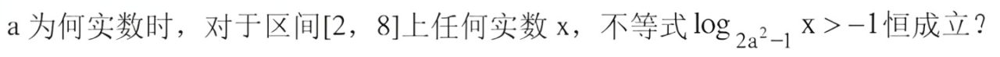

# 基于 Llama.cpp 的模型测试

**gemma-3 题目复述：**
已知 \(a\) 为实数，对区间 \([2, 8]\) 上任何实数 \(x\)，不等式 \(\log_{2a^{2-1}} x > -1\) 恒成立。求 \(a\) 的取值范围。

原题：

**gemma-3 题目复述：**
题目要求：给定常数 $y = \log_a |x-a|$，其中 $a > 0, a \neq 1$，求 $y > 0$ 的 $x$ 的取值范围。

原题：

**gemma-3 题目复述：**

已知不等式 \(\sqrt{\log^2 x + \log_a x - 2} < 2\log_a x - 2\) (a > 0, a ≠ 1)。求 x 的取值范围。

原题：

## 2. 内存占用与性能测试

### 2.1 参数1
参数：
gemma-3-12B-Q4 + 2048 token + 默认batch-size + 8线程
性能：
tps: 5.31 tokens/s
mem: 14.26 G

### 2.1 参数2
参数：
gemma-3-12B-Q4 + 2048 token + 默认 batch-size + cache-type-k q4_0 + 8线程
性能：
tps: 5.25 tokens/s
mem: 14.05 G

## 3. Intern-VL3-8B-Q4 模型测试

### 3.1 Intern-VL3-8B-Q4 正确性测试

题目复述：
已知 \(\sin^2 \theta + \sin \theta = 1\)，求 \(\cos^2 \theta + \cos^6 \theta\) 之值。
解题步骤：
首先，我们已知 \(\sin^2 \theta + \sin \theta = 1\)。根据三角恒等式 \(\sin^2 \theta + \cos^2 \theta = 1\)，可以得到 \(\cos^2 \theta = \sin^2 \theta\)。这意味着 \(\cos \theta\) 的平方与 \(\sin \theta\) 的平方相等。

题目：求 \(\log_{x^2} 16 + \log_{2x} 64 = 3\) 的解集。

**解题步骤：**

1. **定义域分析：**
   - 对于 \(\log_{x^2} 16\)，要求 \(x^2 > 0\) 且 \(x^2 \neq 1\)。
   - 对于 \(\log_{2x} 64\)，要求 \(2x > 0\) 且 \(2x \neq 1\)。
   - 结合以上条件，\(x \neq 0, \pm 1\)。

2. **将对数转换为指数形式：**
   - \(\log_{x^2} 16 = \frac{\log_2 16}{\log_2 x^2} = \frac{4}{2\log_2 x}\)
   - \(\log_{2x} 64 = \frac{\log_2 64}{\log_2 2x} = \frac{6}{\log_2 2 + \log_2 x} = \frac{6}{1 + \log_2 x}\)
   - 则原方程变为 \(\frac{4}{2\log_2 x} + \frac{6}{1 + \log_2 x} = 3\)。

3. **设 \(y = \log_2 x\)，则方程变为：**
   - \(\frac{2}{y} + \frac{6}{1 + y} = 3\)
   - 解此方程得到 \(y = 2\) 或 \(y = -1\)。

4. **将 \(y\) 的解代入 \(x\)：**
   - 当 \(y = 2\) 时，\(\log_2 x = 2\)，解得 \(x = 4\)。
   - 当 \(y = -1\) 时，\(\log_2 x = -1\)，解得 \(x = \frac{1}{2}\)。

5. **验证解的正确性：**
   - 代入 \(x = 4\) 和 \(x = \frac{1}{2}\) 回到原方程，验证是否满足条件。

**结论：**
解集为 \(\{4, \frac{1}{2}\}\)。

**知识点总结：**
- 对数的基本性质和转换公式。
- 方程的定义域分析。
- 指数和对数的相互转换。
- 解方程时的变量替换技巧。

### 3.2 Mimo 正确性测试

方程 \(\log_{x^2} 16 + \log_{2x} 64 = 3\) 的解集为 \(\boldsymbol{\left\{ 4, 2^{-\frac{1}{3}} \right\}}\)（或写作 \(\left\{ 4, \frac{1}{\sqrt[3]{2}} \right\}\)）。

1 - 正确
6 - 正确